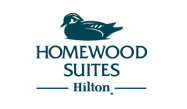
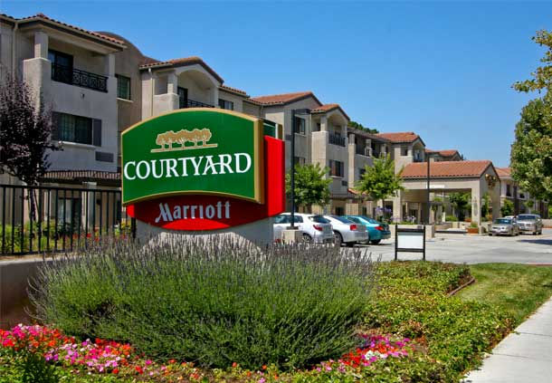

## Hotels with Group Rates

We have reserved room blocks at these two hotels, which are located conveniently near the wedding venue and the downtown areas of Palo Alto and Mountain View. The hotels are directly across the street from each other.

Please make your booking as soon as possible to ensure that you are able to get the discounted group rate.

    

        
 
        	 
        

        

        <h2>Homewood Suites by Hilton - Palo Alto</h2>
		    4329 El Camino Real | Palo Alto, CA 94306   

		    A room rate of $139/night (including breakfast) is available from 06/13/16 to 06/21/16.  
		        Online: <a target="_blank" href="http://homewoodsuites.hilton.com/en/hw/groups/personalized/P/PAOPAHW-SBW-20160613/index.jhtml?WT.mc_id=POG">Book here</a> 
		        By Phone: (650) 559-8700 | ask for Sankaran-Burke Wedding group rate   
		    
		    Please book by 06/01/16. 
        

    

    

        
 
        	 
        

        

        <h2>Courtyard Marriot - Palo Alto Los Altos</h2>
    	4320 El Camino Real | Los Altos, CA 94022   

    	A room rate of $129/night (including breakfast) is available from 06/16/16 to 06/19/16. 
        Online: <a target="_blank" href="http://www.marriott.com/meeting-event-hotels/group-corporate-travel/groupCorp.mi?resLinkData=Saumya-Tim%20Wedding%5Epaocy%60sausaua%7Csausaub%60129.00%60USD%60false%604%606/16/16%606/19/16%605/28/16&app=resvlink&stop_mobi=yes">Book here</a> 
        By Phone: (650) 941-9900 | ask for Saumya-Tim Wedding group rate  
    	
    	Please book by 05/28/16.
        

    

## Other Accommodations

If you are looking for accommodations outside the abovementioned hotel blocks:

There are a number of hotel options available around Palo Alto and Mountain View that would be convenient distances to the wedding venue. Please keep in mind, as you explore these options, that we will be in the midst of wedding season in the Bay Area, so it is recommended that you book as early as possible to ensure that you get rooms where you want.

If you want to stay in San Francisco, please note that the wedding venue is a ~45 minute drive away with no traffic, and will take an hour and a half in rush hour traffic.

Airbnb is a great option for accommodation. Please note that Airbnb bookings in the Bay Area (especially around Mountain View, so close to the Google plex) often have longer minimum stays and prefer to rent to long-term visitors, contractors and summer interns.
