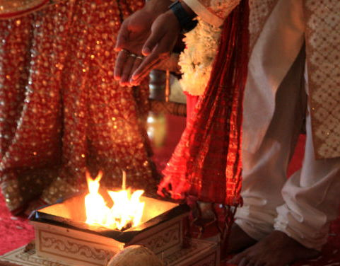
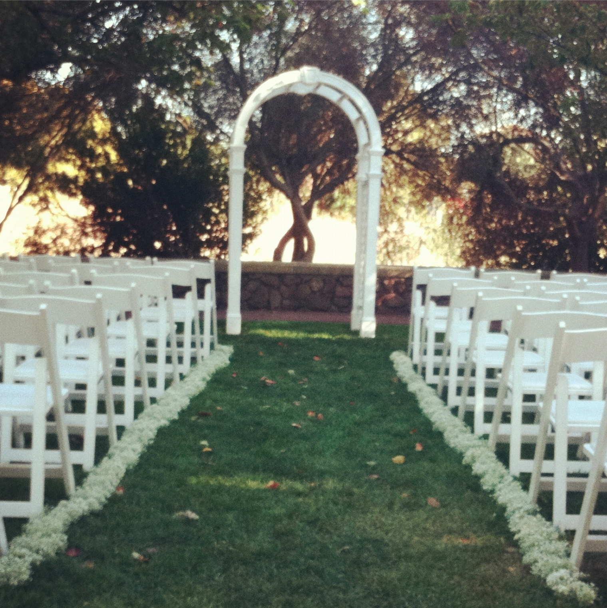

    

        
 
        	 
        

        

        <h2>Indian Wedding</h2>

We will begin with a Hindu wedding ceremony, dressed in traditional Indian clothing. A priest will recite a series of blessings and prayers in Sanskrit in front of a sacred fire, after which the bride and groom will circle the sacred fire and take the vows of marriage. Tim will then tie a necklace symbolizing marriage around Saumya’s neck - this is the origin of the phrase “tying the knot”. Lastly, the couple will be blessed by the parents and other family. (Descriptions and translations of the prayers and vows will be provided in the program.)

It is traditional to celebrate this ceremony (and generally any happy life event) by “making your mouth sweet,” so there will be Indian sweets and snacks after the Indian ceremony. 

<em>(Guests are invited to enjoy the snacks and play lawn games while the wedding party changes clothes between ceremonies.)</em>

        

    

    

        
 
        	 
        

        

        <h2>American Wedding</h2>

We will then have an American wedding ceremony. After the wedding party enters in a Processional, a celebrant will start the ceremony and call upon Readers to do readings from the Bible. Tim and Saumya will exchange vows, and wedding rings to symbolize their union. Finally, the celebrant together with the congregation will bless the couple. And this will conclude our wedding ceremonies!

        

    

