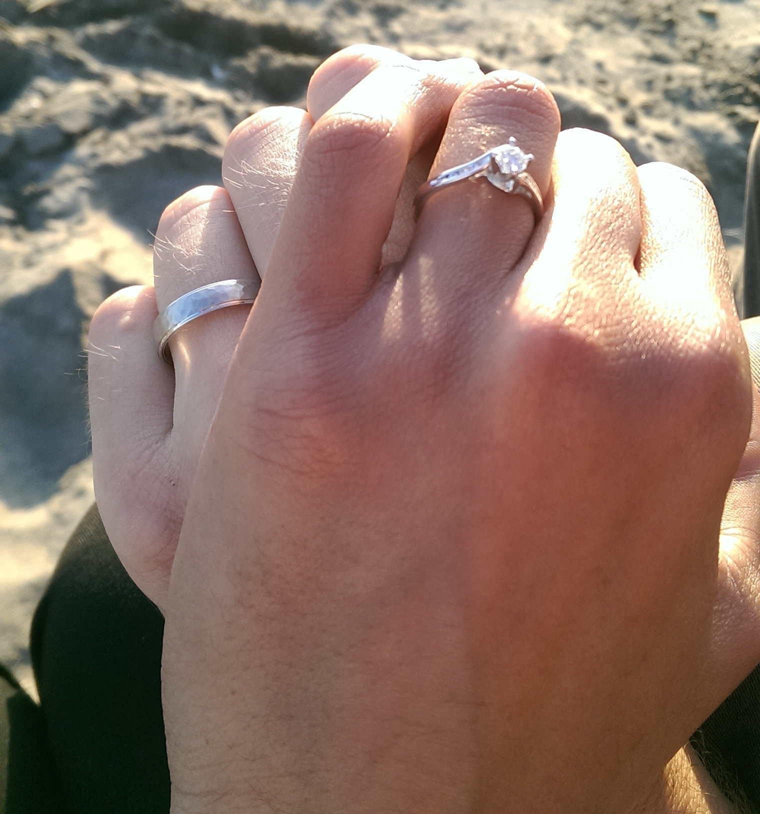
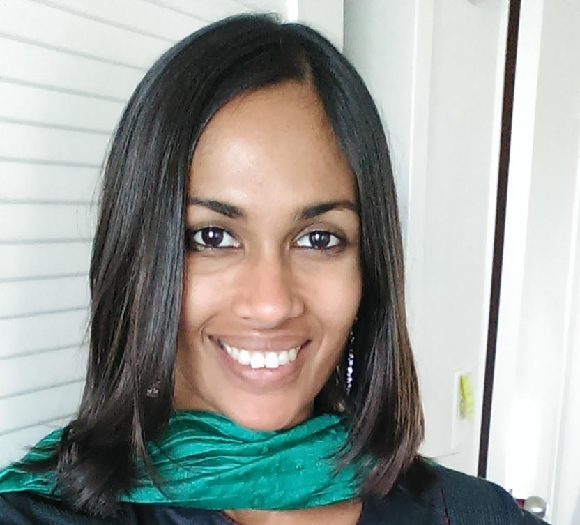
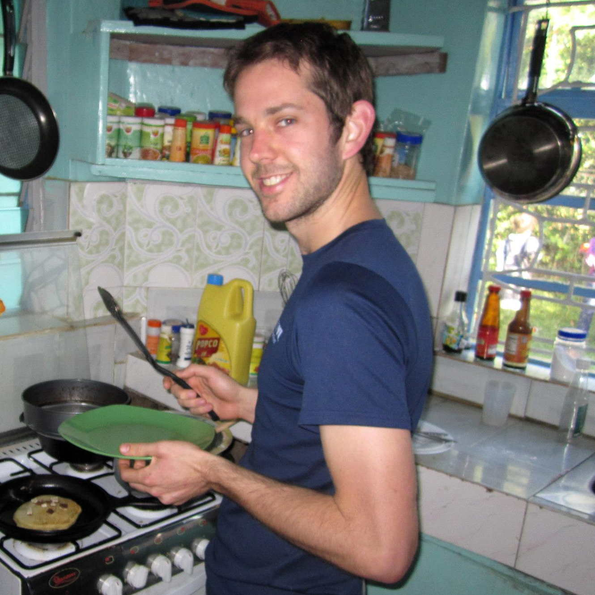

	Tim &amp; Saumya
	6.18.2016
	Mountain View, CA

Welcome to our wedding website! We are very excited to have you join us for our wedding celebration! The tabs above will provide you with information to help you plan for your visit and for our wedding events. We look forward to seeing you in the San Francisco Bay Area in June! 

    

        
 
        	 
        

        

The first time we met was at an ice cream social hosted by mutual friends. Yes, really!
We met almost five years ago, early in our graduate school years at Stanford. Through group dinners, we discovered that we had a lot in common - a love of world travel, Latin music, and hikes in beautiful landscapes, to name a few. (You’ll see a lot of pictures of trees in our photo gallery.) Last spring, we spent a day in the Santa Cruz mountains and then took a walk along the beach where, at sunset, Tim proposed. We exchanged engagement rings as a token of our commitment to each other.
        

    

    

        
 
        	 
        

        

        <h2>About Saumya</h2>
I was born in Mumbai, India. When I was seven years old, my father’s job moved us to Maracaibo, Venezuela, where I grew up in the American International School community. (Did you know that there are Overseas Girl Scout troops? We didn’t have the cookies, though.) I returned to India to spend the last two years of high school at the Mahindra United World College (UWC) of India - the best boarding school experience ever! After UWC, I came to the US for college, and experienced the delights and… ahem, challenges... of New England weather at Brandeis University in Massachusetts. For graduate school, I moved to the more temperate (and temperamental) San Francisco Bay Area to pursue a PhD in Molecular Biology at Stanford. There, I met Tim… and the rest is history!
        

    

    

        

        	 
        

        

        <h2>About Tim</h2>
INSERT CONTENT HERE!!!
        

    

